# Create Azure AI Studio

Azure OpenAI Service brings the generative AI models developed by OpenAI to the Azure platform, enabling you to develop powerful AI solutions that benefit from the security, scalability, and integration of services provided by the Azure cloud platform. In this exercise, you'll learn how to get started with Azure OpenAI by provisioning the service as an Azure resource and using Azure OpenAI Studio to deploy and explore OpenAI models.

## Before you start

You'll need an Azure account that is able to create services before you can continue.

## Provision an Azure OpenAI resource

Navigate to Azure AI Portal [https://ai.azure.com/](https://ai.azure.com/).

You will see a page like this one:

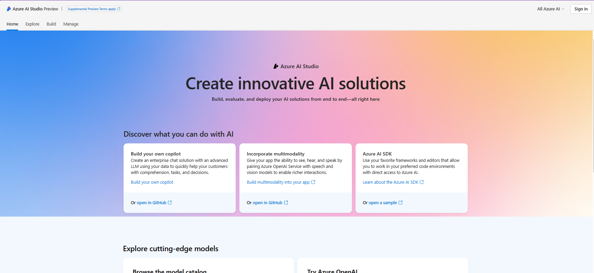

Login with the credentials provided.

## Home Section
The home section provides shortcuts to creating new models or exploring existing projects.

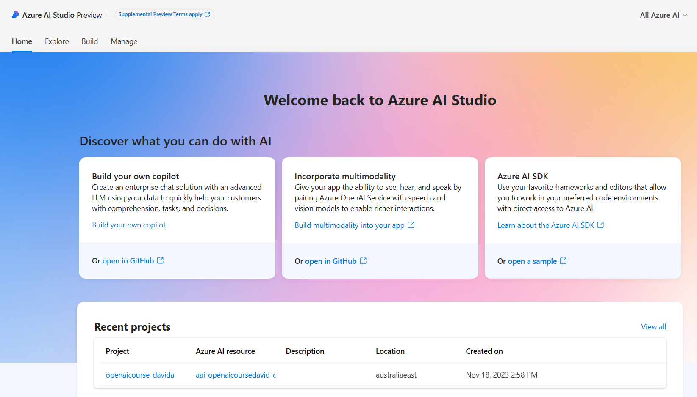

## Explore Section
Navigate to the Explore section, during this course will be using some of the options available within Azure AI Studio.

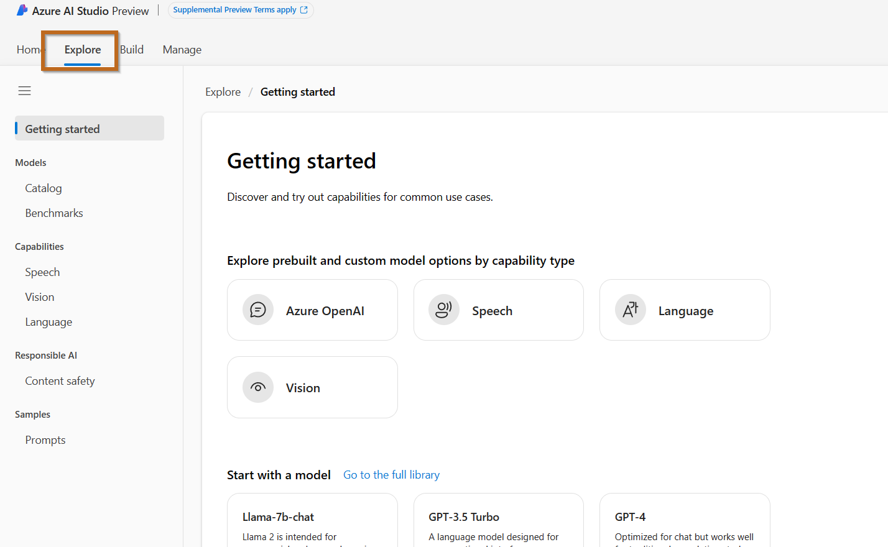

There are a few options available:

1. Getting Started
2. Model
    - **Catalog**: you will find models available from OpenAI and other providers like Meta / NVIDIA and Hugging Face
    - **Benchmarks**: Compare benchmarks across models and datasets available in the industry to assess which one meets your business scenario.
3. Capabilities
    - **Speech**: Build voice-enabled apps confidently and quickly. Transcribe speech to text with high accuracy. Produce natural-sounding text-to-speech voices. Translate spoken audio and use speaker recognition during conversations.
    - **Vision**: Give your apps the ability to read text, analyze images, and detect faces with technology like optical character recognition (OCR) and machine learning.
    - **Language**: Build your apps with natural language understanding and generation with confidence and productivity. Interpret natural language with pre-built, task-optimized language models for immediate value and with customization capability to adapt to your business needs. Classify and summarize documents, get real-time translations, or integrate language into your bot experiences.

4. Responsible AI
    - **Content Safety**: Azure AI Content Safety detects harmful user-generated and AI-generated content in applications and services. Content Safety includes text and image APIs that allow you to detect material that is harmful.

5. Samples
    - **Prompts**: Choose a sample prompt to see how it works or as a starting point for your project. Then customize it for your scenario and evaluate how it performs before integrating into your app.

## Build Section
In this section, you will be able to organise solutions into projects. Let's create a project.

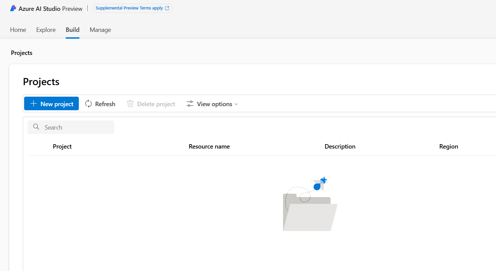

### Create a New Project

Let's create a new project.

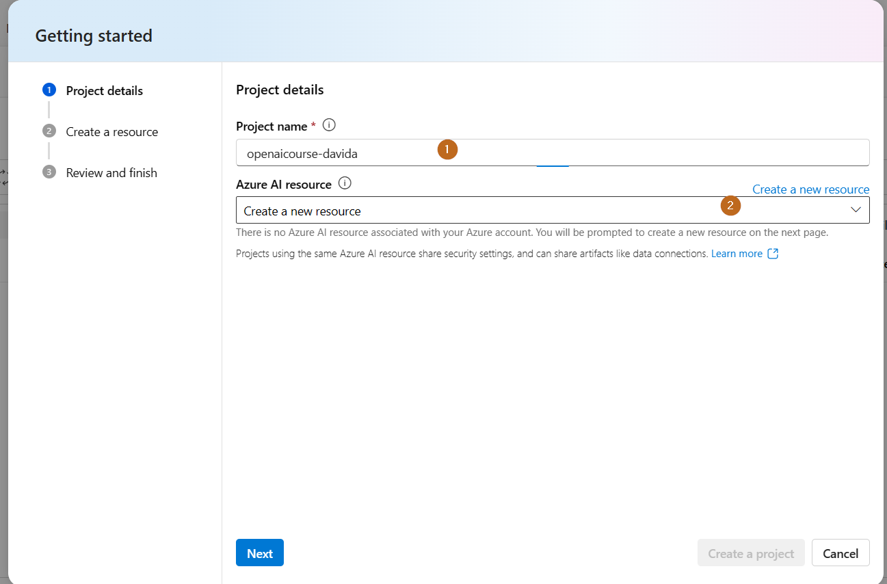

1. Make sure you select a meaningful name for the project.
2. An Azure AI Resource is required. The Azure AI Resource is hosted directly in your Azure Subscription.

When creating the Azure AI resource, I suggest following proper naming conventions. An Azure service will be created.

1. Create an **Azure OpenAI** resource with the following settings:
    - **Subscription**: An Azure subscription that has been approved for access to the Azure OpenAI service.
    - **Resource group**: Choose the existing resource group you have access to, you will not have access to create a new one.
    - **Region**: Choose Australia East.
    - **Name**: A unique name of your choice. A good naming convention: **{Resource Type}{App Name}{Environment}{Region}[{Instance}]** 
      - Example: **aai-openaicoursedavid-dev-aue**

    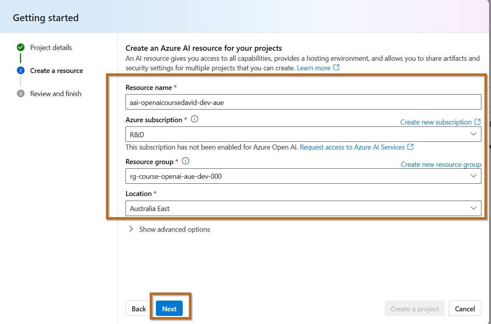

    Continue to the final page

    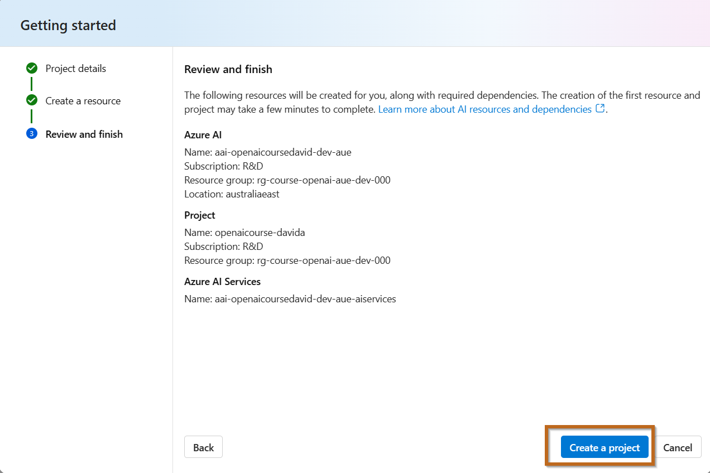

2. Wait for deployment to complete, this will take a few minutes. 

**Checkpoint:** Once the project is created, let the instructor know.

Navigate to Azure Portal [https://portal.azure.com/](https://portal.azure.com/).

You will see the underlined services created in your resource group.

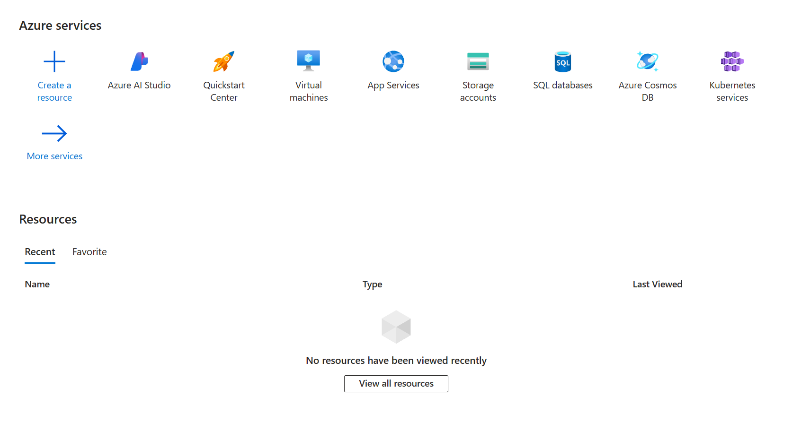

Click View All Resources.

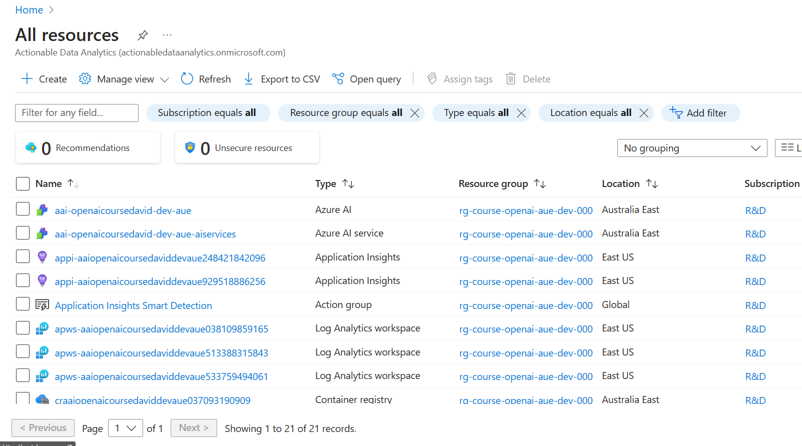

Azure AI Portal has created more than 15 services for you.

  > **Note**: Another way to create the Azure AI Service is from the Azure Portal. This is the recommended approach for enterprise deployment as it offers more options in regards to networking and security.

## Example creating service in Azure Portal

  > **Note**: You don't have to create another service.

The following example shows how to create the service in the Azure Portal.

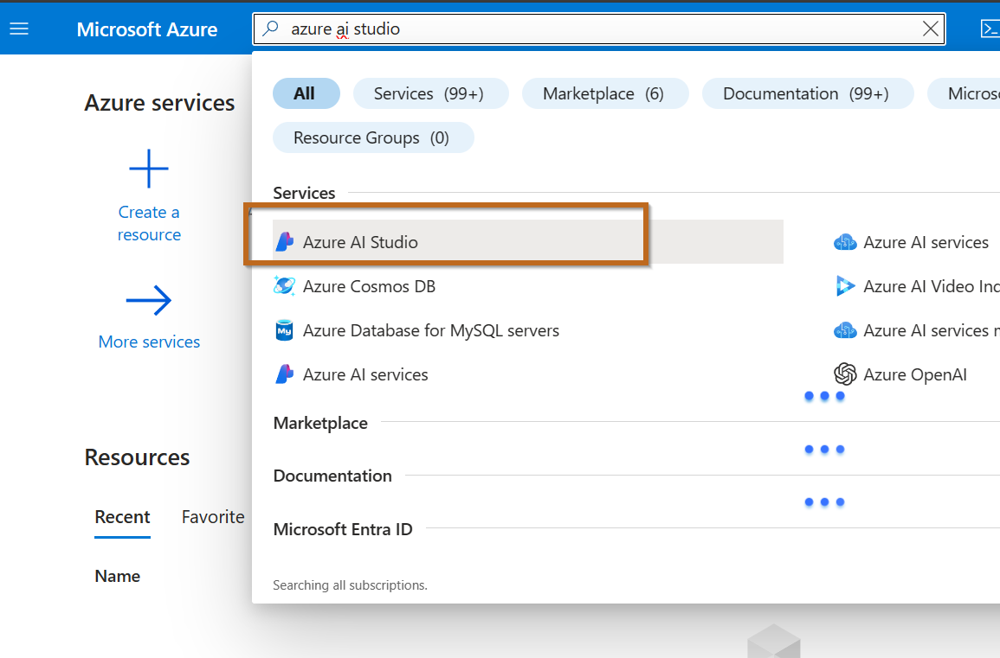

Click create.

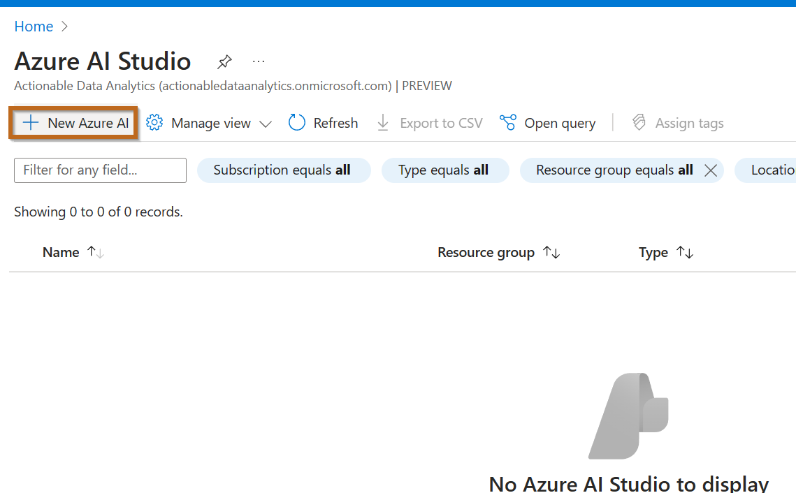

Configure all the options.

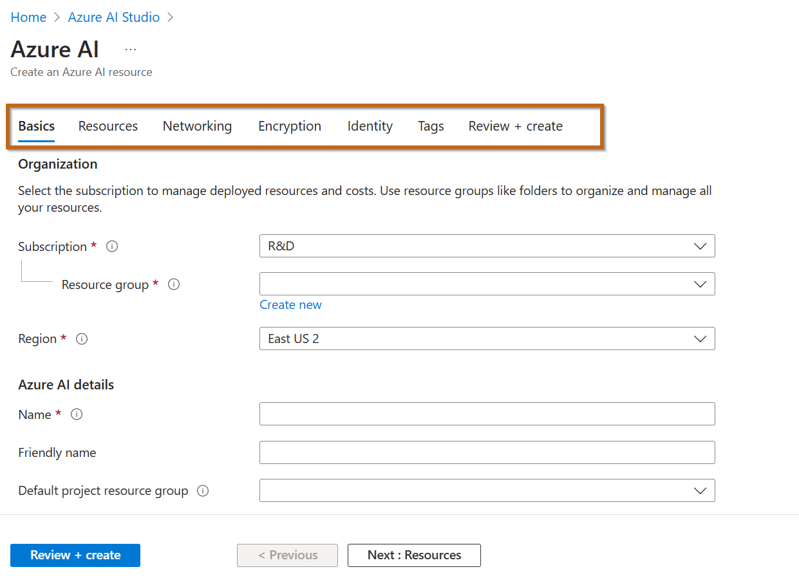

## Manage Section
You will be able to manage all the resources. 

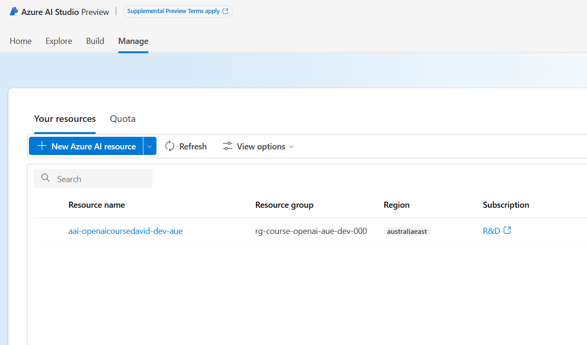

Click on the previously created project.

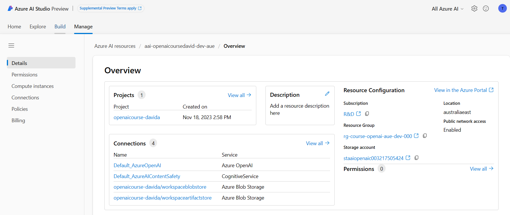

1. **Details**: High-level overview of your different projects, connections and resources.
2. **Permissions**: Access Control List for managing resources. To be able to grant access, you will have to be an owner.
3. **Compute Instances**: View and manage computes for your Azure AI resource. Create computes, delete computes, and review all compute resources you have in one place.
4. **Connections**: You can view all Connections in your Azure AI resource by their Name,  Authentication method,
5. **Policies**: View and configure policies for your Azure AI resource. See all the policies you have in one place. Policies are applied across all Projects
6. **Billing**: Information related to the on-going cost of the services.
   

## Common Errors
Sometimes, the subscription needs some resource providers to be registered, this can be done by an admin at the Subscription level in the Azure portal.

Error:

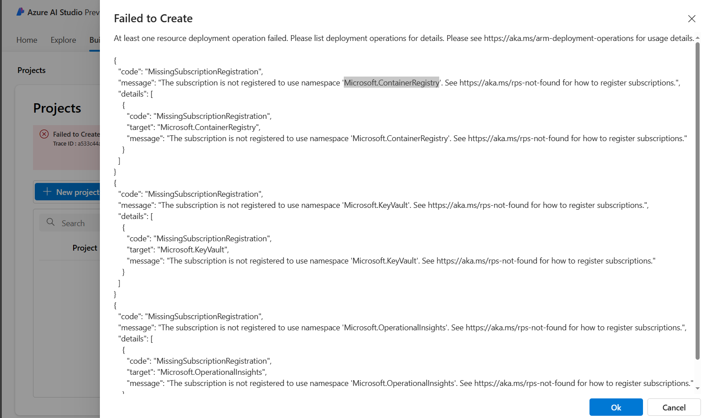

Registering providers in Azure:

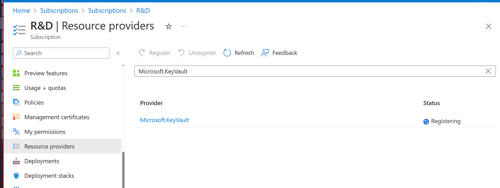

