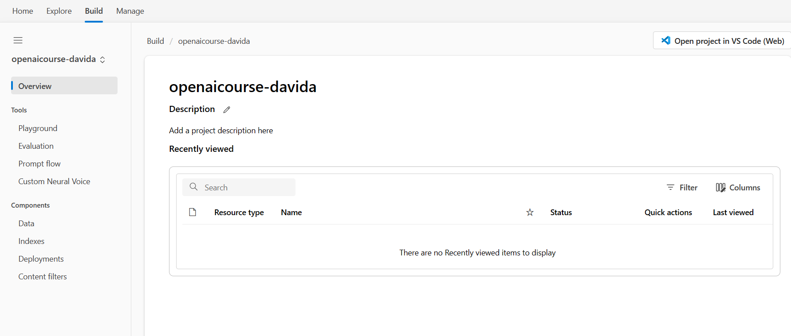

---
lab:
    title: 'Get started with Azure AI Studio'
---


# Create Azure AI Studio

Azure OpenAI Service brings the generative AI models developed by OpenAI to the Azure platform, enabling you to develop powerful AI solutions that benefit from the security, scalability, and integration of services provided by the Azure cloud platform. In this exercise, you'll learn how to get started with Azure OpenAI by provisioning the service as an Azure resource and using Azure OpenAI Studio to deploy and explore OpenAI models.

This exercise takes approximately **30** minutes.

## Before you start

You'll need an Azure account that is able to create services before you can continue


## Provision an Azure OpenAI resource

Navigate to Azure AI Portal [https://ai.azure.com/](https://ai.azure.com/).


You will see a page like this one:


Login with the credentials provided.


## Home Section
The home section provides shortcuts to creating new models or exploring existing projects.


## Explore Section
Navigate to the Explore section, during this course will be using some of the options available within Azure AI Studio.


There are a few options available:

1. Getting Started
2. Model
    - **Catalog**: you will find models available from OpenAI and other providers like Meta / NVIDIA and Hugging Face
    - **Benchmarks**: Compare benchmarks across models and datasets available in the industry to assess which one meets your business scenario.
3. Capabilities
    - **Speech**: Build voice-enabled apps confidently and quickly. Transcribe speech to text with high accuracy. Produce natural-sounding text-to-speech voices. Translate spoken audio and use speaker recognition during conversations.
    - **Vision**: Give your apps the ability to read text, analyze images, and detect faces with technology like optical character recognition (OCR) and machine learning.
    - **Language**: Build your apps with natural language understanding and generation with confidence and productivity. Interpret natural language with pre-built, task-optimized language models for immediate value and with customization capability to adapt to your business needs. Classify and summarize documents, get real-time translations, or integrate language into your bot experiences.

4. Responsible AI
    - **Content Safety**: Azure AI Content Safety detects harmful user-generated and AI-generated content in applications and services. Content Safety includes text and image APIs that allow you to detect material that is harmful.

5. Samples
    - **Prompts**: Choose a sample prompt to see how it works or as a starting point for your project. Then customize it for your scenario and evaluate how it performs before integrating into your app.


## Build Section
In this section, you will be able to organise solutions into projects. Let's create a project.


### Create a New Project.


1. Make sure you select a meaningful name for the project.
2. An Azure AI Resource is required. The Azure AI Resource is hosted directly in your Azure Subscription.

When creating the Azure AI resource, I suggest following proper naming conventions. An Azure service will be created.


1. Create an **Azure OpenAI** resource with the following settings:
    - **Subscription**: An Azure subscription that has been approved for access to the Azure OpenAI service.
    - **Resource group**: Choose the existing resource group you have access to, you will not have access to create a new one.
    - **Region**: Choose Australia East.
    - **Name**: A unique name of your choice. A good naming convention: **{Resource Type}{App Name}{Environment}{Region}[{Instance}]** 
      - Example: **aai-openaicoursedavid-dev-aue**


Continue to the final page


2. Wait for deployment to complete, this will take a few minutes. 


**Checkpoint:** Once the project is created, let the instructor know.


Navigate to Azure Portal [https://portal.azure.com/](https://portal.azure.com/).

You will see the underlined services created in your resource group.


Click View All Resources.


Azure AI Portal has created more than 15 services for you.

  > **Note**: Another way to create the Azure AI Service is from the Azure Portal. This is the recommended approach for enterprise deployment as it offers more options in regards to networking and security.


  > **Note**: You don't have to create another service.


Example creating service in Azure Portal:


Click create.


Configure all the options.


## Manage Section
You will be able to manage all the resources. 


Click on the previously created project.


1. **Details**: High-level overview of your different projects, connections and resources.
2. **Permissions**: Access Control List for managing resources. To be able to grant access, you will have to be an owner.
3. **Compute Instances**: View and manage computes for your Azure AI resource. Create computes, delete computes, and review all compute resources you have in one place.
4. **Connections**: You can view all Connections in your Azure AI resource by their Name,  Authentication method,
5. **Policies**: View and configure policies for your Azure AI resource. See all the policies you have in one place. Policies are applied across all Projects
6. **Billing**: Information related to the on-going cost of the services.
   


## Common Errors
Sometimes, the subscription needs some resource providers to be registered, this can be done by an admin at the Subscription level in the Azure portal.

Error:


Registering providers in Azure:


# Navigate the different options within your project.



1. **Overview**: 
2. Tools
   1. **Playground**: You can test your model and chat session.
   2. **Evaluation**: Evaluate your model performance with industry standard metrics to compare and choose the best version based on your need. 
   3. **Prompt flow**:  Prompt flow is a development tool designed to streamline the entire development cycle of AI applications powered by Large Language Models (LLMs). 
   4. **Custom neural voice**: Design your unique voice persona and efficiently manage voice talents, data sets, models, test runs, and endpoint connections. 
3. Components
   1. **Data**: Import your data for the models.
   2. **Indexes**: Create indexes to customize generative AI responses.
   3. **Deployments**: Create the deployment infrastructure to start consuming your model externally.
   4. **Content filters**: Azure OpenAI Service includes a content management system that works alongside core models to filter content. Content filtering configurations can be created within a Resource and assigned to Deployments.


## Deploy a model

Azure OpenAI provides a web-based portal named **Azure OpenAI Studio**, that you can use to deploy, manage, and explore models. You'll start your exploration of Azure OpenAI by using Azure OpenAI Studio to deploy a model.

1. On the **Overview** page for your Azure OpenAI resource, use the **Go to Azure OpenAI Studio** button to open Azure OpenAI Studio in a new browser tab.
2. In Azure OpenAI Studio, on the **Deployments** page, view your existing model deployments. If you don't already have one, create a new deployment of the **gpt-35-turbo-16k** model with the following settings:
    - **Model**: gpt-35-turbo-16k
    - **Model version**: Auto-update to default
    - **Deployment name**: *A unique name of your choice*
    - **Advanced options**
        - **Content filter**: Default
        - **Tokens per minute rate limit**: 5K\*
        - **Enable dynamic quota**: Enabled

    > \* A rate limit of 5,000 tokens per minute is more than adequate to complete this exercise while leaving capacity for other people using the same subscription.

> **Note**: In some regions, the new model deployment interface doesn't show the **Model version** option. In this case, don't worry and continue without setting the option.

## Use the Chat playground

The *Chat* playground provides a chatbot interface for GPT 3.5 and higher models. It uses the *ChatCompletions* API rather than the older *Completions* API.

1. In the **Playground** section, select the **Chat** page, and ensure that your model is selected in the configuration pane.
2. In the **Assistant setup** section, in the **System message** box, replace the current text with the following statement: `The system is an AI teacher that helps people learn about AI`.

3. Below the **System message** box, click on **Add few-shot examples**, and enter the following message and response in the designated boxes:

    - **User**: `What are different types of artificial intelligence?`
    - **Assistant**: `There are three main types of artificial intelligence: Narrow or Weak AI (such as virtual assistants like Siri or Alexa, image recognition software, and spam filters), General or Strong AI (AI designed to be as intelligent as a human being. This type of AI does not currently exist and is purely theoretical), and Artificial Superintelligence (AI that is more intelligent than any human being and can perform tasks that are beyond human comprehension. This type of AI is also purely theoretical and has not yet been developed).`

    > **Note**: Few-shot examples are used to provide the model with examples of the types of responses that are expected. The model will attempt to reflect the tone and style of the examples in its own responses.

4. Save the changes to start a new session and set the behavioral context of the chat system.
5. In the query box at the bottom of the page, enter the text `What is artificial intelligence?`
6. Use the **Send** button to submit the message and view the response.

    > **Note**: You may receive a response that the API deployment is not yet ready. If so, wait for a few minutes and try again.

7. Review the response and then submit the following message to continue the conversation: `How is it related to machine learning?`
8. Review the response, noting that context from the previous interaction is retained (so the model understands that "it" refers to artificial intelligence).
9. Use the **View Code** button to view the code for the interaction. The prompt consists of the *system* message, the few-shot examples of *user* and *assistant* messages, and the sequence of *user* and *assistant* messages in the chat session so far.

## Explore prompts and parameters

You can use the prompt and parameters to maximize the likelihood of generating the response you need.

1. In the **Parameters** pane, set the following parameter values:
    - **Temperature**: 0
    - **Max response**: 500

2. Submit the following message

    ```
    Write three multiple choice questions based on the following text.

    Most computer vision solutions are based on machine learning models that can be applied to visual input from cameras, videos, or images.*

    - Image classification involves training a machine learning model to classify images based on their contents. For example, in a traffic monitoring solution you might use an image classification model to classify images based on the type of vehicle they contain, such as taxis, buses, cyclists, and so on.*

    - Object detection machine learning models are trained to classify individual objects within an image, and identify their location with a bounding box. For example, a traffic monitoring solution might use object detection to identify the location of different classes of vehicle.*

    - Semantic segmentation is an advanced machine learning technique in which individual pixels in the image are classified according to the object to which they belong. For example, a traffic monitoring solution might overlay traffic images with "mask" layers to highlight different vehicles using specific colors.
    ```

3. Review the results, which should consist of multiple-choice questions that a teacher could use to test students on the computer vision topics in the prompt. The total response should be smaller than the maximum length you specified as a parameter.

    Observe the following about the prompt and parameters you used:

    - The prompt specifically states that the desired output should be three multiple choice questions.
    - The parameters include *Temperature*, which controls the degree to which response generation includes an element of randomness. The value of **0** used in your submission minimizes randomness, resulting in stable, predictable responses.

## Explore code-generation

In addition to generating natural language responses, you can use GPT models to generate code.

1. In the **Assistant setup** pane, select the **Empty Example** template to reset the system message.
2. Enter the system message: `You are a Python developer.` and save the changes.
3. In the **Chat session** pane, select **Clear chat** to clear the chat history and start a new session.
4. Submit the following user message:

    ```
    Write a Python function named Multiply that multiplies two numeric parameters.
    ```

5. Review the response, which should include sample Python code that meets the requirement in the prompt.

## Clean up

When you're done with your Azure OpenAI resource, remember to delete the deployment or the entire resource in the [Azure portal](https://portal.azure.com).
