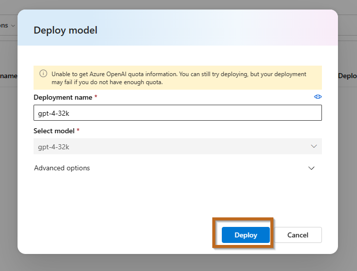

---
lab:
    title: 'Navigate Azure AI Project'
---

# Navigate Azure AI Project Options

This guide helps you navigate through the different options within your Azure AI Project.

## Project Overview

Start by returning to the build section and selecting your project.

### Key Sections in Your Project

1. **Overview**: A general overview of your project's status and settings.
2. **Tools**: Tools available for your project:
   - **Playground**: Test your model and chat session here.
   - **Evaluation**: Evaluate model performance with standard metrics to choose the best version for your needs.
   - **Prompt Flow**: A development tool for streamlining AI application development with Large Language Models (LLMs).
   - **Custom Neural Voice**: Design a unique voice persona and manage voice talents, datasets, models, tests, and endpoint connections.
3. **Components**: Essential components for your project:
   - **Data**: Import data for your models.
   - **Indexes**: Create indexes to customize generative AI responses.
   - **Deployments**: Set up the deployment infrastructure for external model consumption.
   - **Content Filters**: Manage content filtering configurations that work alongside core models.

## Deployments

Before utilizing the playground, you need to create a deployment.

1. **Create a New Deployment**:
   
   - Select the model you wish to deploy.
     
   - Confirm and deploy the model.
     

2. **Repeat for Additional Models**:
   - Select another model.
     
   - Deploy this model as well.
     

    > **Note**: Creating multiple models can help manage heavy traffic and provide alternatives.

3. **Navigate to the Playground**:
   

    > **Tip**: Deploying multiple models is useful for testing solutions and choosing the right model.

## Using the Playground

The *Chat* playground offers a chatbot interface for your deployment models, utilizing the *ChatCompletions* API.

1. **Explore Options**: Familiarize yourself with various features in this section. We will delve into more details in the next exercise.

    > **Info**: The top right corner of the playground displays the API in use.
