---
lab:
    title: 'AI Studio Prompt Engineering'
---

# Prompt Engineering
Prompt engineering refers to the process of carefully designing and structuring the input or "prompt" given to an AI model, especially a language model like GPT-3 or GPT-4, to elicit the most accurate, relevant, or creative response. This process is crucial because the way a prompt is phrased significantly influences the model's output.


# Adding Context Marathon Example
In the chat session, write the following sentence `I run an ultra-marathon and then...`.
You will see that model does not have the context for this sentence.

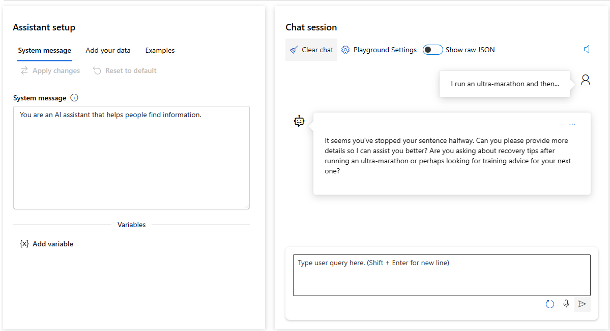

To provide context, in the **Assistant setup** section, in the **System message** box, replace the current text with the following statement: `Finish the sentence`.

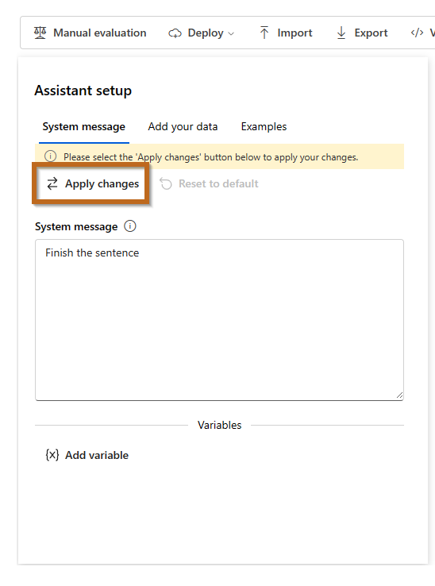


Now, try again.

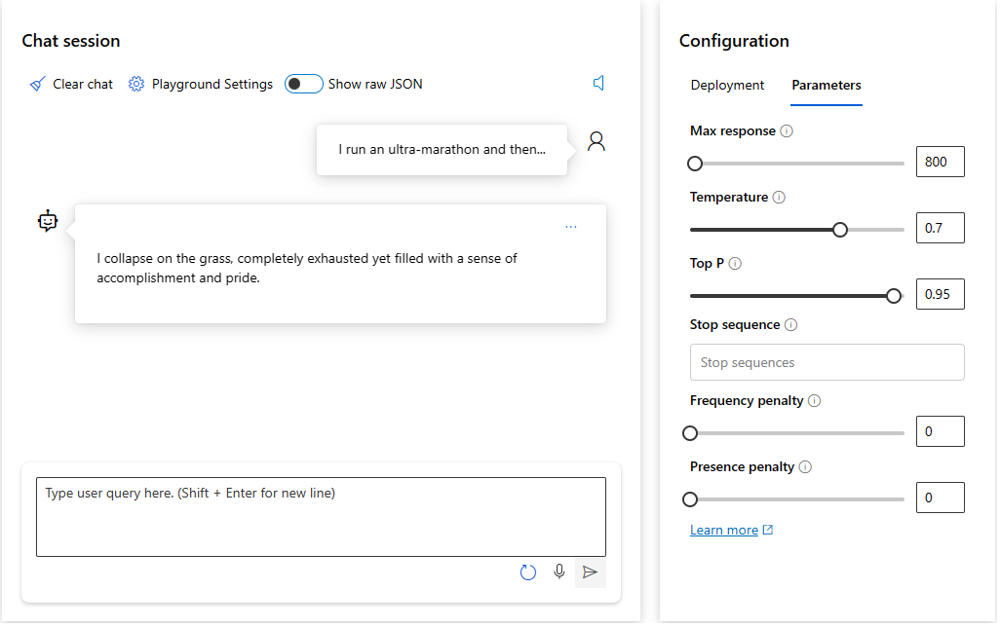

Reset the system message:


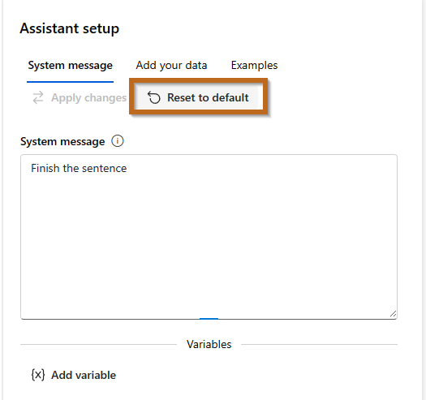


**Checkpoint:** Once the project is created, let the instructor know.


# Adding Context Generating Data
Let's try a different example for generating data. 


Include the following in the **System message**:

 `As a random data generator assistant designed for generating test datasets for databases, format the output as follows: Column1, Column2, Column3, Column4, etc.`


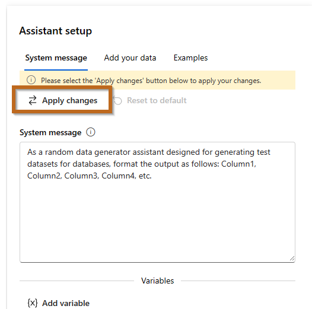

In the chat session, type the following request:

` Create a set of 10 test records for a database, including each record's first name, last name, phone number, email address, and an Australian postcode, mainly from Queensland. `

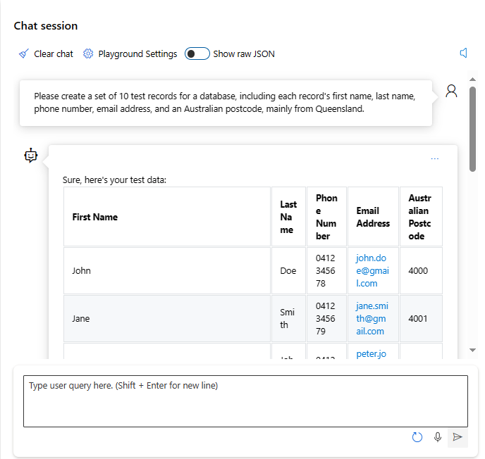


  > **Note**: Generating dummy data can help automate testing applications with test data.

Reset the system message:


# Using Prompt Samples
Azure AI Studio offers some examples, navigate to **Prompt Samples**.

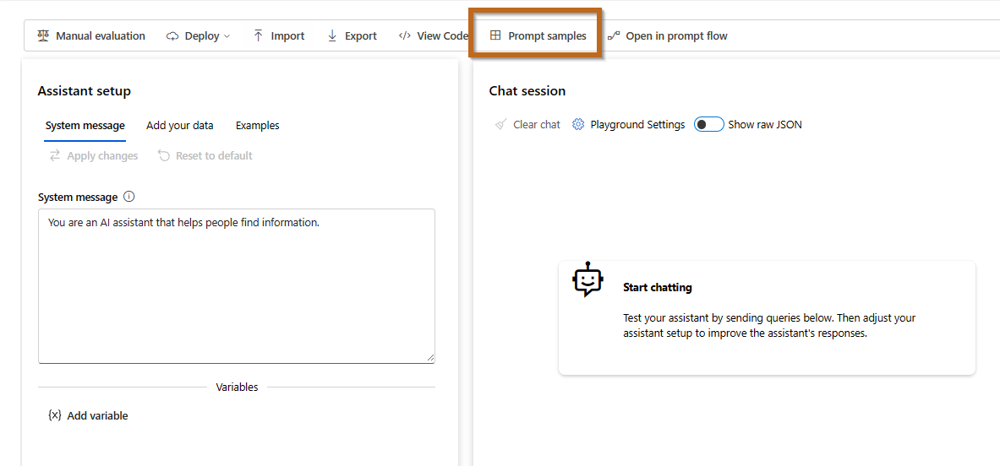


Select the Json Formatter Assistant.

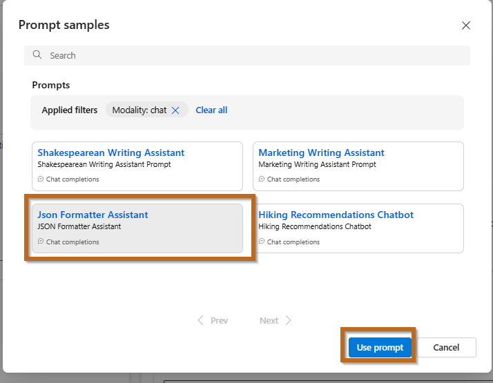


Try the same message as the previous exercise. In the chat session, type the following request:

` Create a set of 10 test records for a database, including each record's first name, last name, phone number, email address, and an Australian postcode, mainly from Queensland. `


Look in the configuration pane, you can change how many previous messages you want to send to the model.

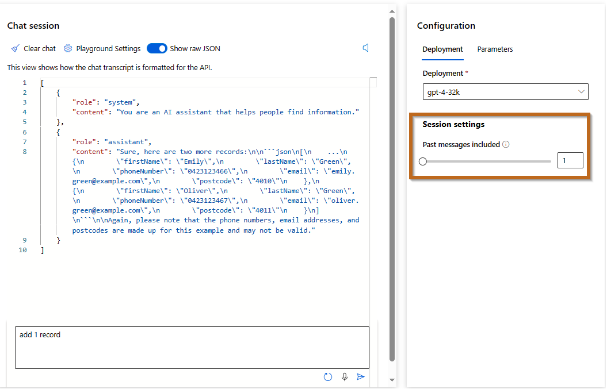

 > **Note**: The more previous messages you send, the more tokens you will require and the cost of the transaction will increase.


Configure the **Past messages included** to 10. This helps give the model context for new user queries. Setting this number to 10 will include 5 user queries and 5 system responses.


Reset the system message:


# Changing Temperature 

Temperature and Top P parameters controls randomness. Lowering the temperature means that the model will produce more repetitive and deterministic responses. Increasing the temperature will result in more unexpected or creative responses. 

For the following exercise, try adjusting temperature or Top P but not both.


Increase the Temperature and Top P parameters and in the chat session, type the following request:
`Suggest an innovative business idea for a post-pandemic world.` 


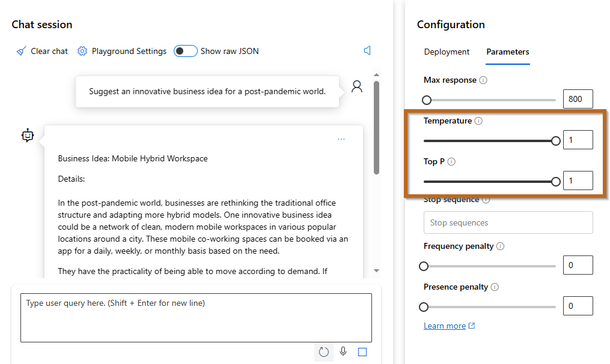

Clear the chat, and try again.

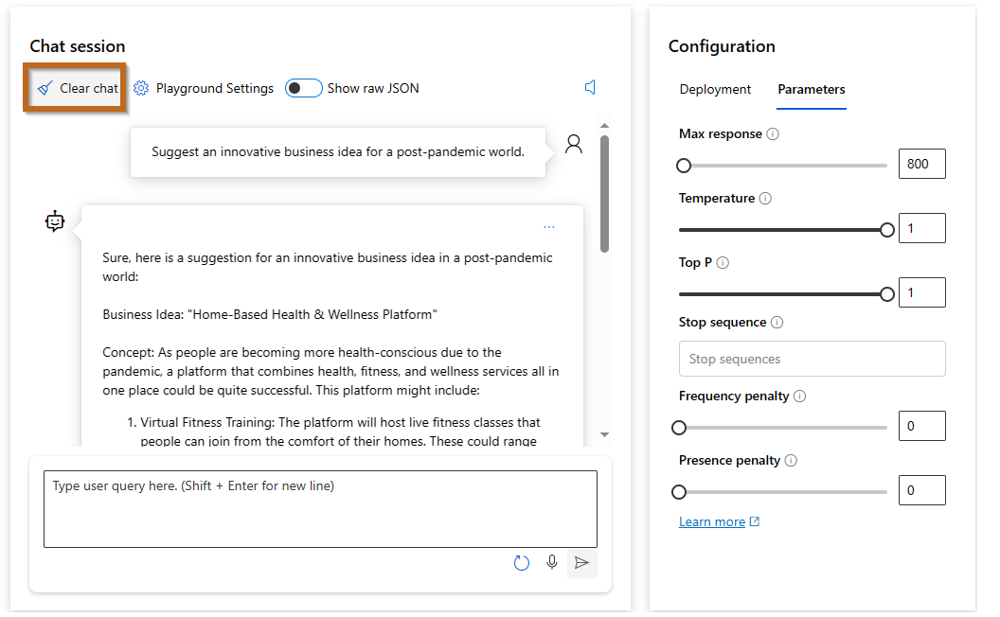


**Are the responses the same?**


Now, let's decrease the temperature and in the chat session, type the following request:


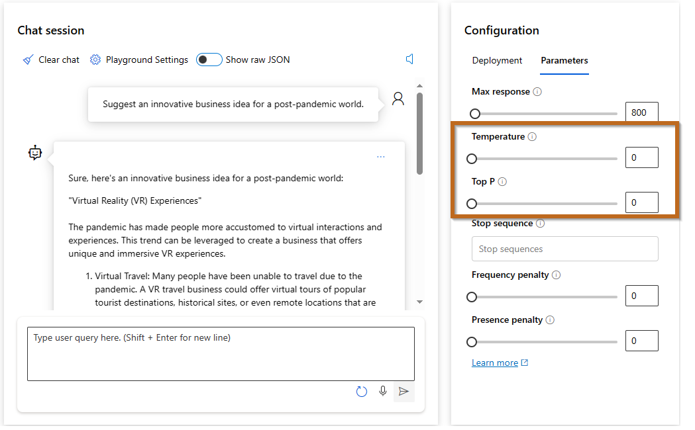

Clear the chat, and try again.

**Are the responses the same?**


# Few-shot Examples (Optional)


1. In the **System message**, include the following message
   `The system is a climate change advocate and authority that helps people learn about climate change.`

   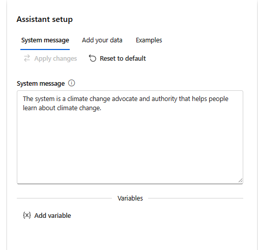

2. Next to **System message** box, click on **Examples** and then on **Add an example**
   
   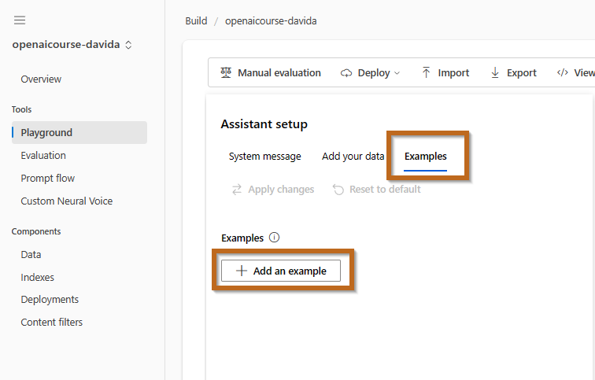

3. Enter the following message and response in the designated boxes:

    - **User**: `What are the main causes of climate change?`
    - **Assistant**: `The main causes of climate change are human activities, particularly the burning of fossil fuels like coal, oil, and gas, leading to greenhouse gas emissions. Deforestation and industrial processes also contribute significantly to climate change. These activities increase the concentration of carbon dioxide, methane, and other greenhouse gases in the Earth's atmosphere, trapping heat and leading to global warming.`

    > **Note**: Few-shot examples are used to provide the model with examples of the types of responses that are expected. The model will attempt to reflect the tone and style of the examples in its own responses.

4. Apply the changes to start a new session and set the behavioral context of the chat system.

    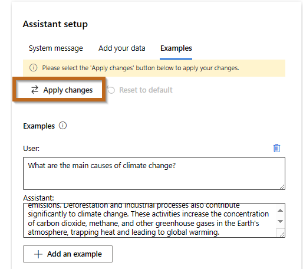

5. In the **Chat session** query box at the bottom of the page, enter the text `What is climate change?`
6. Use the **Send** button to submit the message and view the response.

    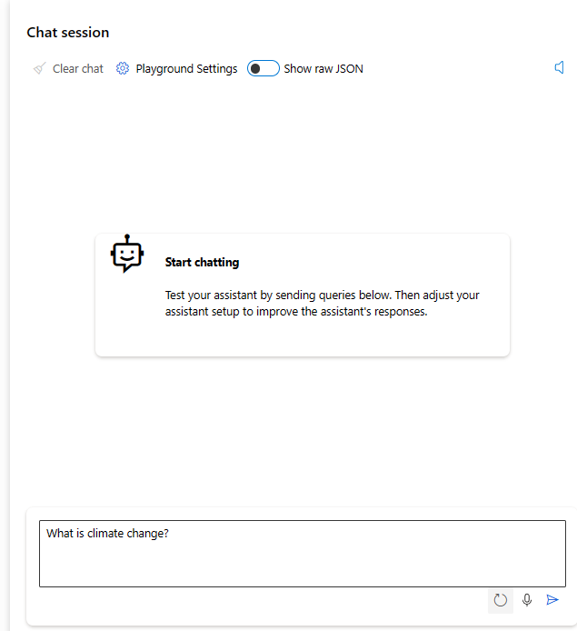

7. Review the response and then submit the following message to continue the conversation: `What can we do to mitigate climate change?`

    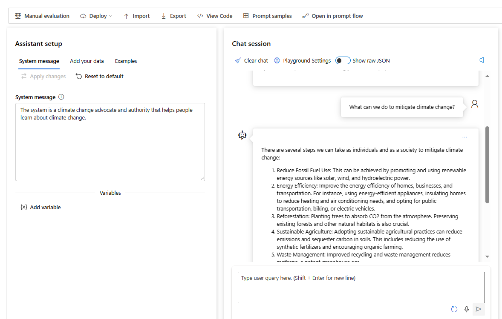

8. This question builds on the previous response, expecting the assistant to provide practical solutions or actions that can be taken to address climate change.
9.  Use the **View Code** button to view the code for the interaction. The prompt consists of the *system* message, the few-shot examples of *user* and *assistant* messages, and the sequence of *user* and *assistant* messages in the chat session so far.


    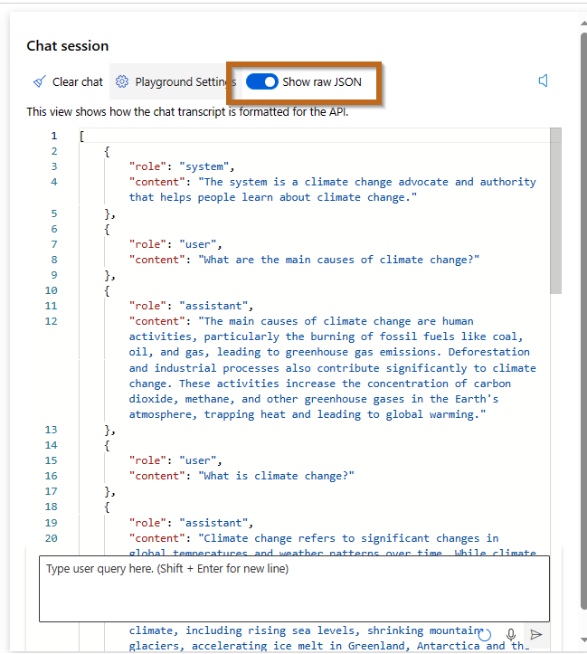


Reset the System Message


Remove the **Examples**


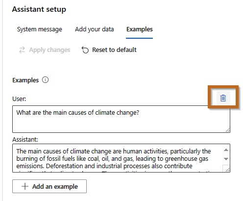


**Apply changes**

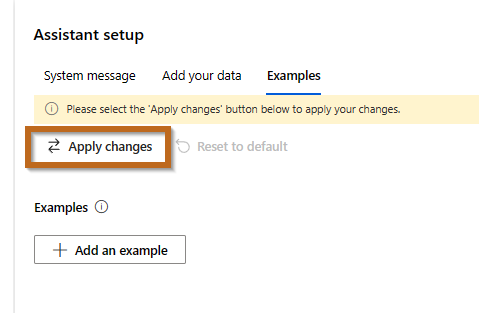


**Checkpoint:** Once the project is created, let the instructor know.


# Explore prompts and parameters (Optional)

You can use the prompt and parameters to maximise the likelihood of generating the response you need.

1. In the **Parameters** pane, set the following parameter values:
    - **Temperature**: 0  (to minimise randomness and ensure predictable responses)
    - **Max response**: 500 (to control the length of the generated content)

    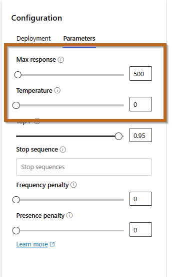

2. Submit the following message

    ```
    Write three multiple choice questions based on the following text.

    Most computer vision solutions are based on machine learning models that can be applied to visual input from cameras, videos, or images.*

    - Image classification involves training a machine learning model to classify images based on their contents. For example, in a traffic monitoring solution you might use an image classification model to classify images based on the type of vehicle they contain, such as taxis, buses, cyclists, and so on.*

    - Object detection machine learning models are trained to classify individual objects within an image, and identify their location with a bounding box. For example, a traffic monitoring solution might use object detection to identify the location of different classes of vehicle.*

    - Semantic segmentation is an advanced machine learning technique in which individual pixels in the image are classified according to the object to which they belong. For example, a traffic monitoring solution might overlay traffic images with "mask" layers to highlight different vehicles using specific colors.
    ```
    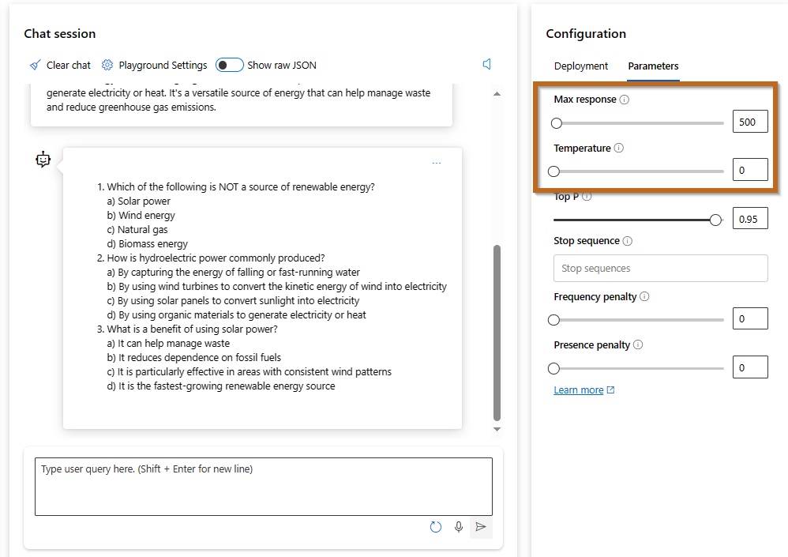

3. After submitting the prompt, review the results which should consist of multiple-choice questions related to renewable energy. These questions should be suitable for a teacher to test students' understanding of the topics mentioned in the prompt. Ensure that the total response is within the 500-character limit.

    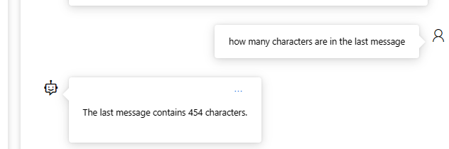

Observe how the specific instruction for three multiple-choice questions guides the output. The temperature setting of 0 ensures that the responses are focused and directly related to the provided text about renewable energy sources.

4. In the **Chat session** pane, select **Clear chat** to clear the chat history and start a new session.


# Explore code-generation (Optional)

In addition to generating natural language responses, you can use GPT models to generate code.

1. In the **System message** include the following message `You are an expert Power BI developer who knows everything about best practices of using DAX for creating new measures.`
   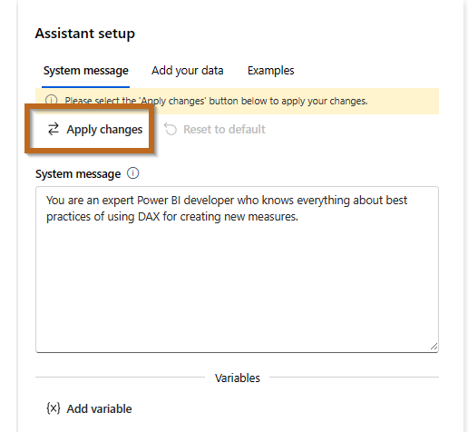
2. In the **Chat session** pane, select **Clear chat** to clear the chat history and start a new session.
3. Submit the following user message:

    ```
    Write a DAX calculation that creates a date dimension.
    ```

4. Review the response, which should include sample DAX code that meets the requirement in the prompt.


    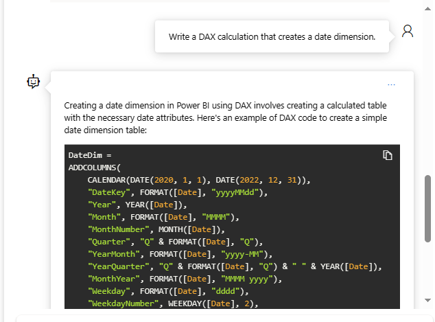


## Create Fictional Destinations Exercise (Optional)

Explore how prompt engineering can shape AI responses to generate creative and unique travel destinations.

1. Navigate to the **Chat** playground in the left pane.
1. In the **Assistant setup** section at the top, enter `You are an AI assistant that helps people find information` as the system message.
1. In the **Chat session** section, enter the following prompt and press *Enter*.

     ```
     Imagine an underwater civilization hidden in the ocean depths. What are some of its most remarkable features?
     ```

   - Observe the AI's creative responses.
    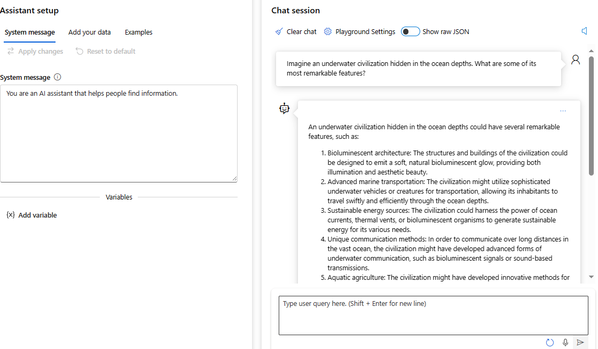

1. **Enhancing Prompt Details**
   - Update **Assistant setup** system message: `You are an AI assistant specialising in creating fictional travel destinations. Use vivid descriptions.`


   - Resend the prompt:
     ```
     Imagine an underwater civilization hidden in the ocean depths. What are some of its most remarkable features?
     ```

    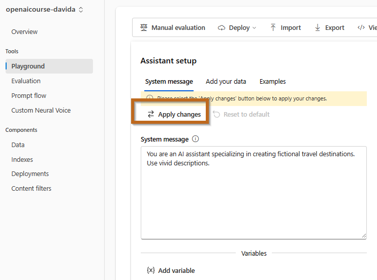

2. **Introducing Few-Shot Examples**
   - Click **Add an example** in **Assistant setup**.
   - Example 1:

     **User:**
     ```
     A city where the buildings are made of crystals and glow at night. Describe this luminous city.
     ```
     **Assistant:**
     ```
     The Crystal City shines brightly under the moon, with streets illuminated by the natural glow of its crystal structures. The buildings shimmer in a spectrum of colors, reflecting the city's vibrant nightlife.
     ```

   - Example 2:

     **User:**
     ```
     A forest where the trees are as tall as skyscrapers and the leaves change colors with the seasons. Describe a walk through this forest.
     ```
     **Assistant:**
     ```
     Walking through the Giant Forest is like stepping into a living kaleidoscope. The towering trees, with their vast canopies, shift through a myriad of colors, creating a mesmerizing dance of hues.
     ```

    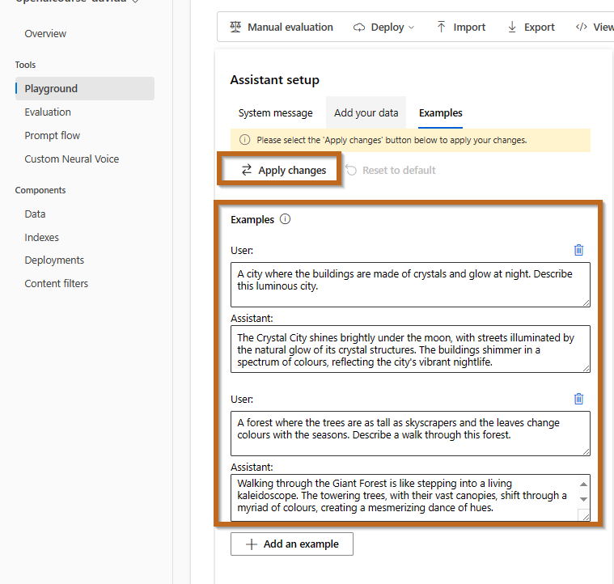

1. **Final Creative Test**
   - Save changes to the assistant setup.
   - Resend the underwater civilization prompt.
   - Observe the enhanced creative response from the AI.

    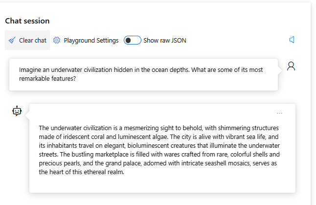


This exercise demonstrates the impact of prompt engineering in guiding AI to create vivid and imaginative descriptions of fictional destinations.
