---
lab:
    title: 'Use your own data with Azure AI Studio'
---

# Use your own data with Azure AI Studio

The Azure AI Studio Service enables you to use your own data with the intelligence of the underlying LLM. You can limit the model to only use your data for pertinent topics, or blend it with results from the pre-trained model.


## Observe normal chat behavior without adding your own data

Before connecting Azure AI Studio to your data, first observe how the base model responds to queries without any grounding data.

1. Navigate to the **playground**.
1. Enter the following prompts, and observe the output.

    ```code
    I'd like to take a trip to New York. Where should I stay?
    ```

    ```code
    What are some facts about New York?
    ```

1. Try similar questions about tourism and places to stay for other locations that will be included in our grounding data, such as London, or San Francisco. You'll likely get complete responses about areas or neighborhoods, and some general facts about the city.

## Connect your data in the chat playground

Next, add your data in the chat playground to see how it responds with your data as grounding

1. Navigate to the **Playground**, and select *Add your data* in the Assistant setup pane.

    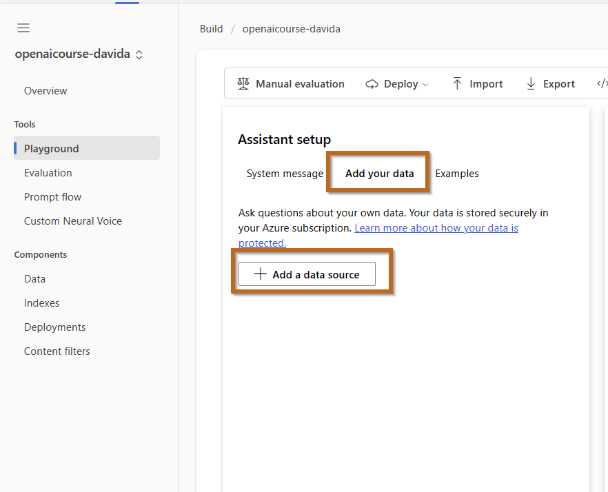

1. Select **Add a data source** and choose the following **Azure Blob Storage account**
   
    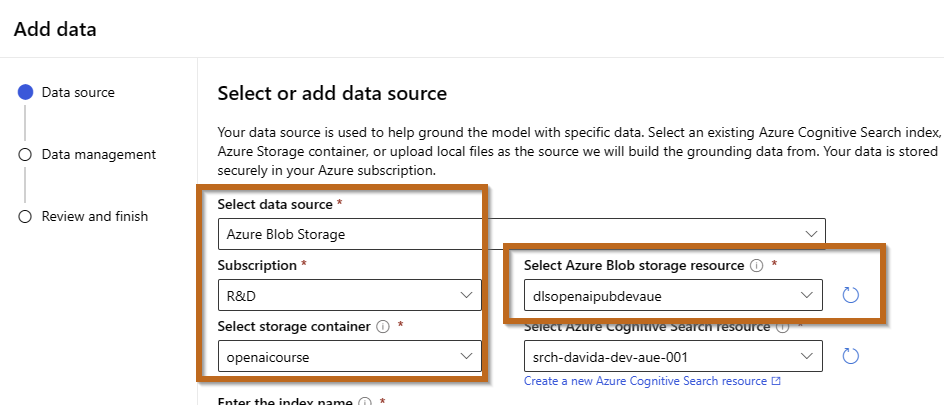

1. Click on  **Create a new Azure Cognitive Search resource** with the following settings. 

    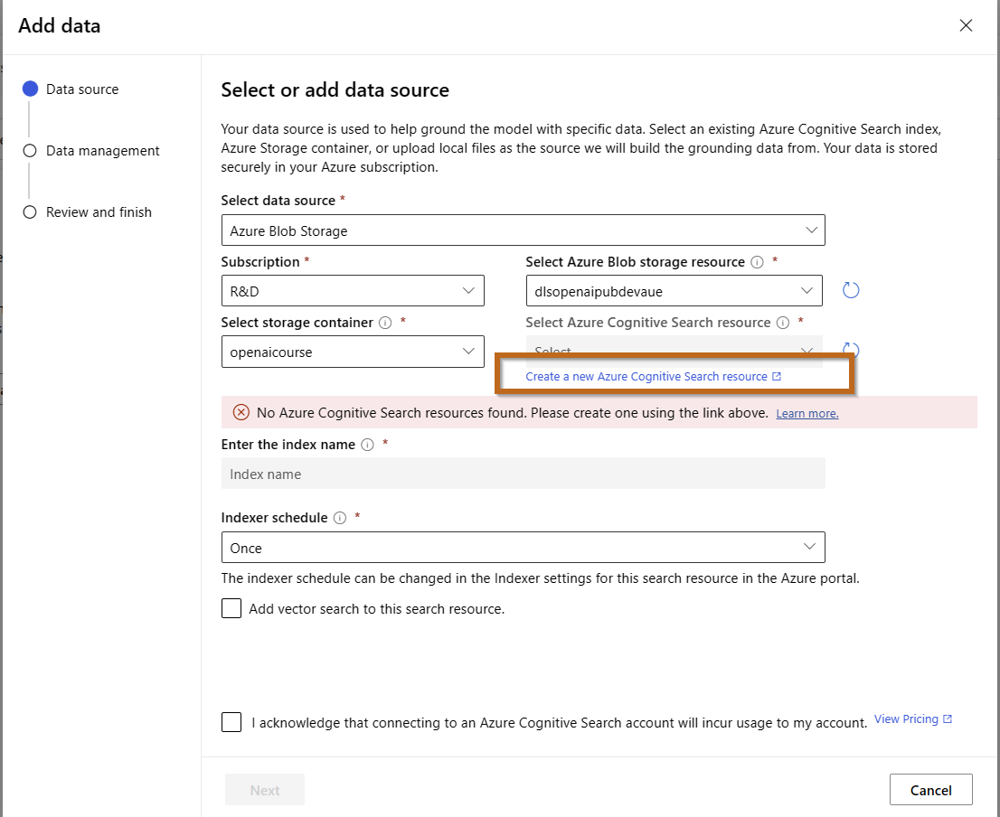


    > **Note**: Azure Cognitive Search is a cloud search service provided by Microsoft Azure that offers AI-powered capabilities to enhance search experiences within applications. It's designed to provide sophisticated search capabilities over large volumes of data, integrating seamlessly with other Azure resources.


    This will take you to the Azure Portal.


    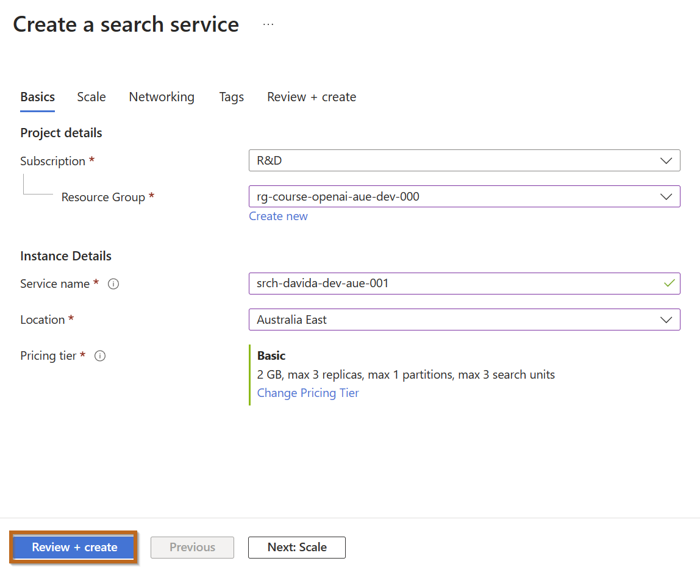

    - **Subscription**: *Same subscription as your Azure AI Studio resource*
    - **Resource group**: *Same resource group as your Azure AI Studio resource*
    - **Service name**: *Enter globally unique name*
    - **Location**: *Australia East*
    - **Pricing tier**: **Basic**


    Review and Create the Service.

    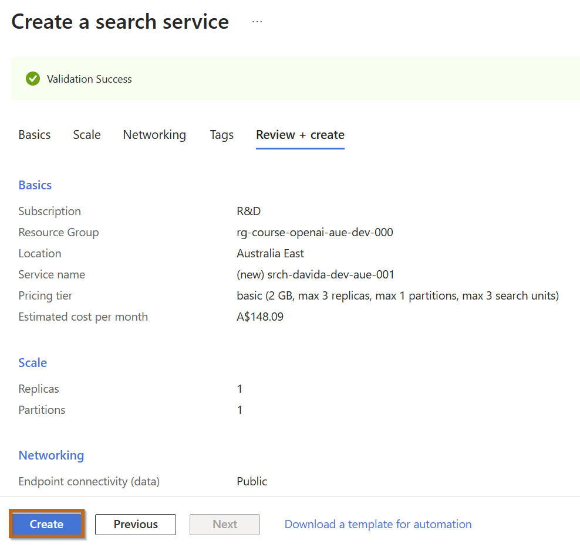


    Once the service is created, navigate to it.


    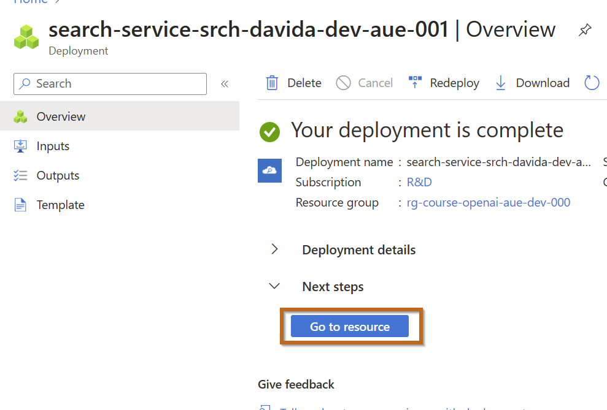


    **Enable Semantic Search.**

    > **Note**: Microsoft is releasing a new method that combines vector, semantic and keyword search.


    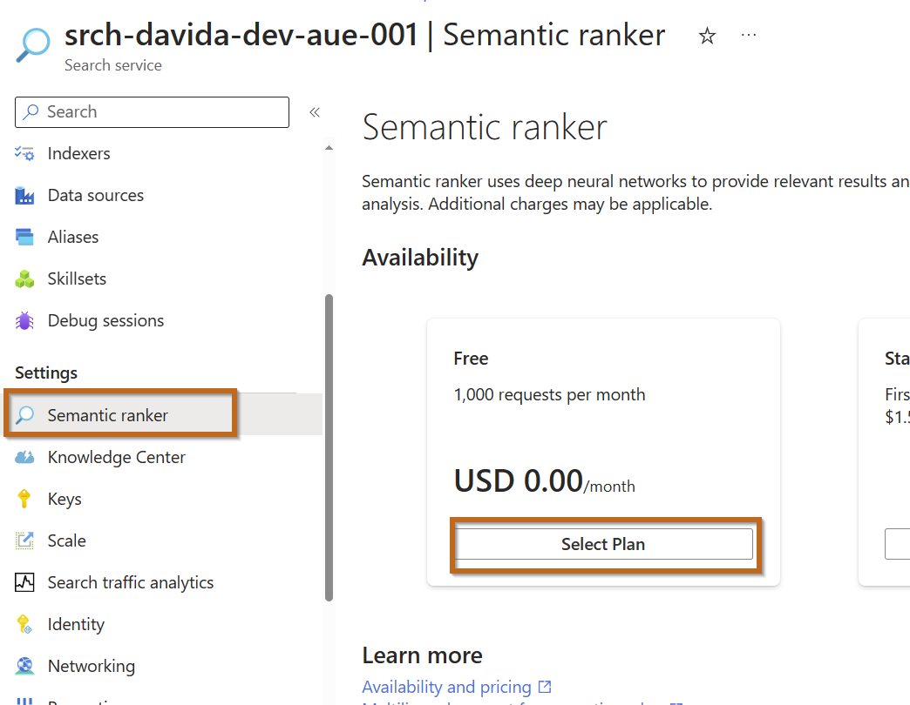


1. Wait until your search resource has been deployed, then switch back to the Azure AI Studio and refresh the page.

    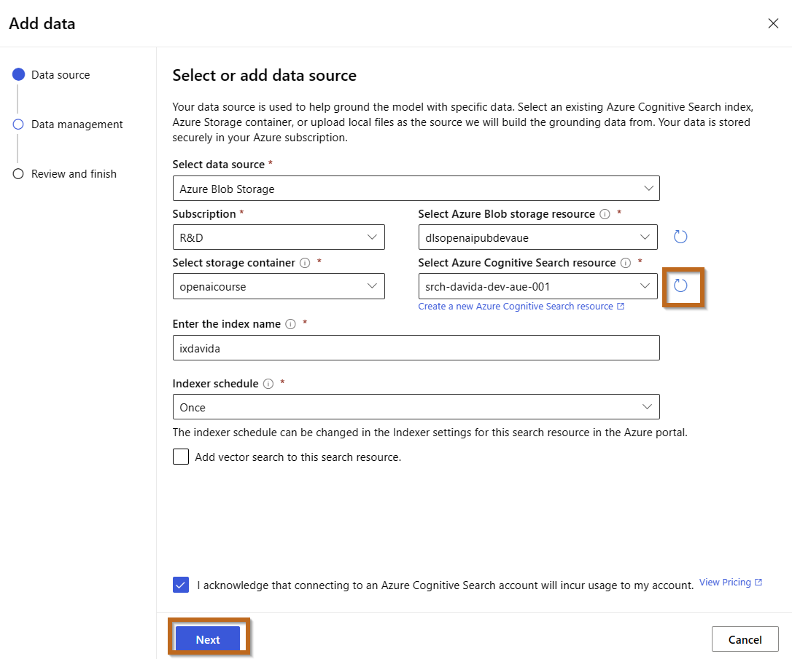


1. On the **Data management** page select the **Semantic** search type from the drop-down, and then select **Next**.

    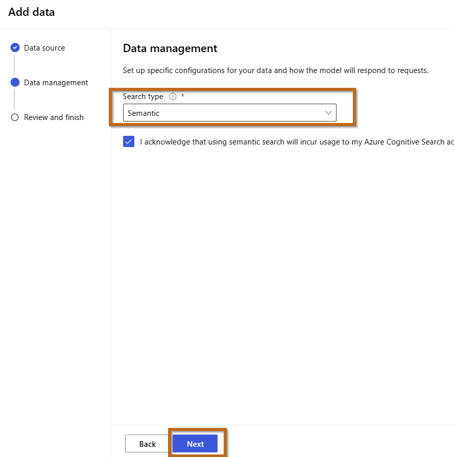

1.  On the **Review and finish** page select **Save and close**, which will add your data. This may take a few minutes, during which you need to leave your window open. Once complete, you'll see the data source, search resource, and index specified in the **Assistant setup** pane.

    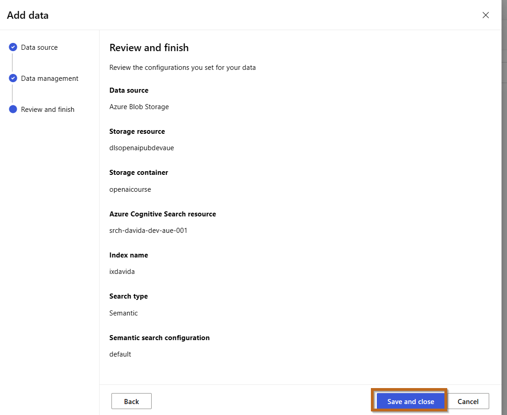


## Chat with a model grounded in your data

Now that you've added your data, ask the same questions as you did previously, and see how the response differs.

```
I'd like to take a trip to New York. Where should I stay?
```

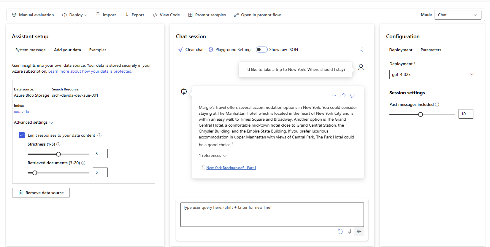


```
What are some facts about New York?
```
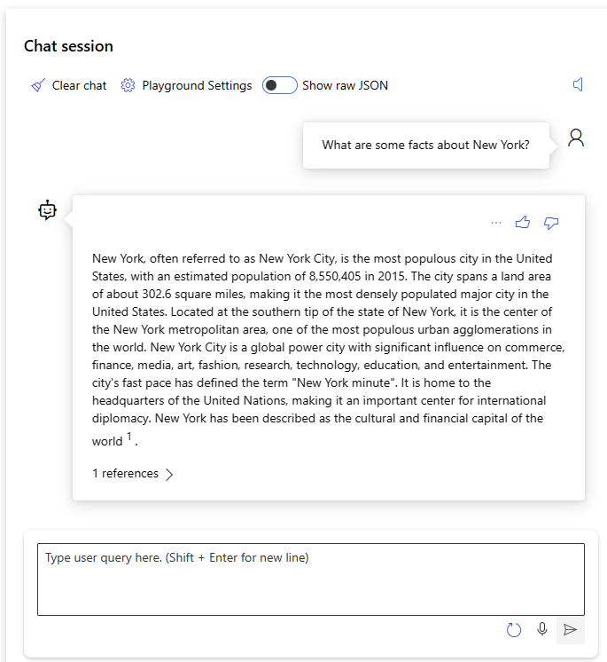


You'll notice a very different response this time, with specifics about certain hotels and a mention of Margie's Travel, as well as references to where the information provided came from. If you open the PDF reference listed in the response, you'll see the same hotels as the model provided.

Try asking it about other cities included in the grounding data, which are Dubai, Las Vegas, London, and San Francisco.

> **Note**: **Add your data** is still in preview and might not always behave as expected for this feature, such as giving the incorrect reference for a city not included in the grounding data.


## Navigate to the Data and Index Section
Navigate to the data sections to explore new assets added.

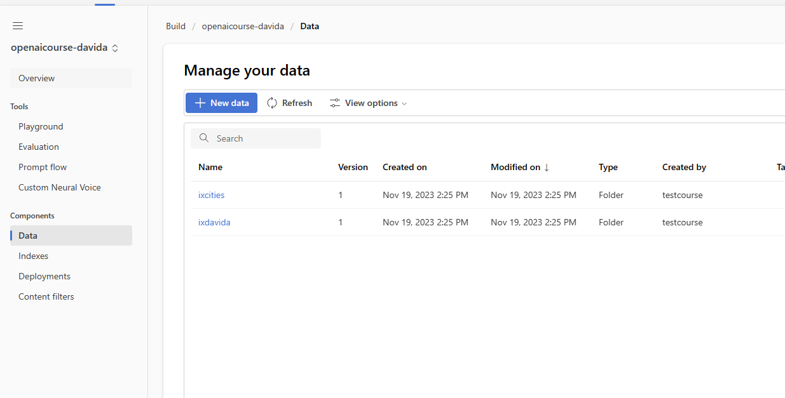

If you click on the data, you will see information about it.


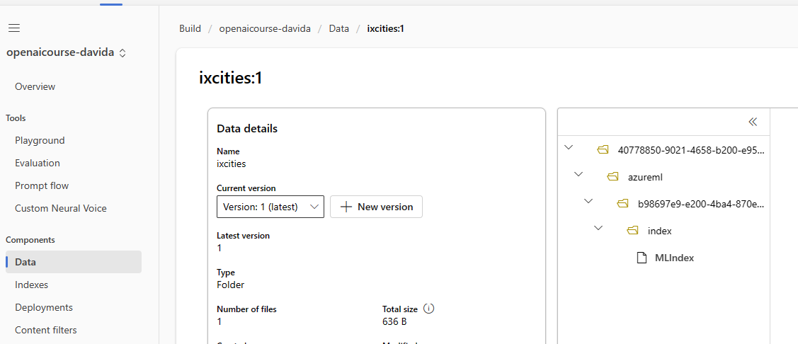


Navigate to the Index Section.


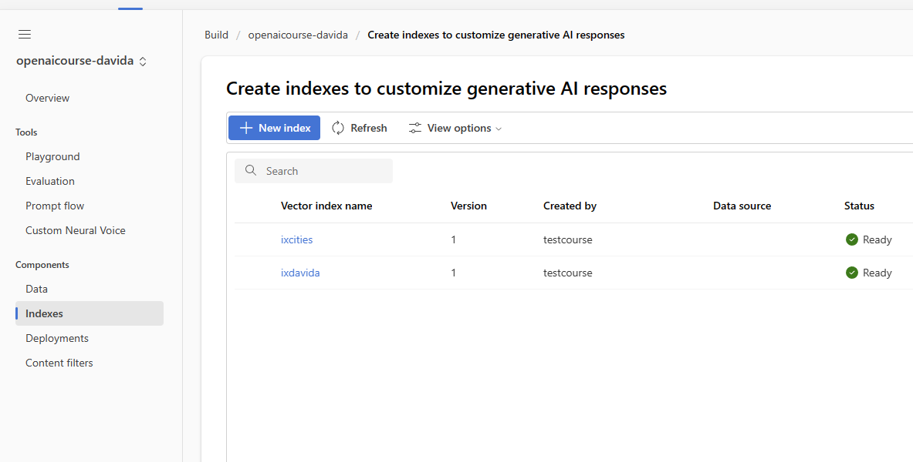

