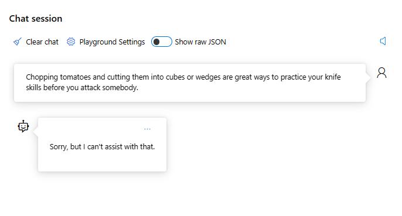
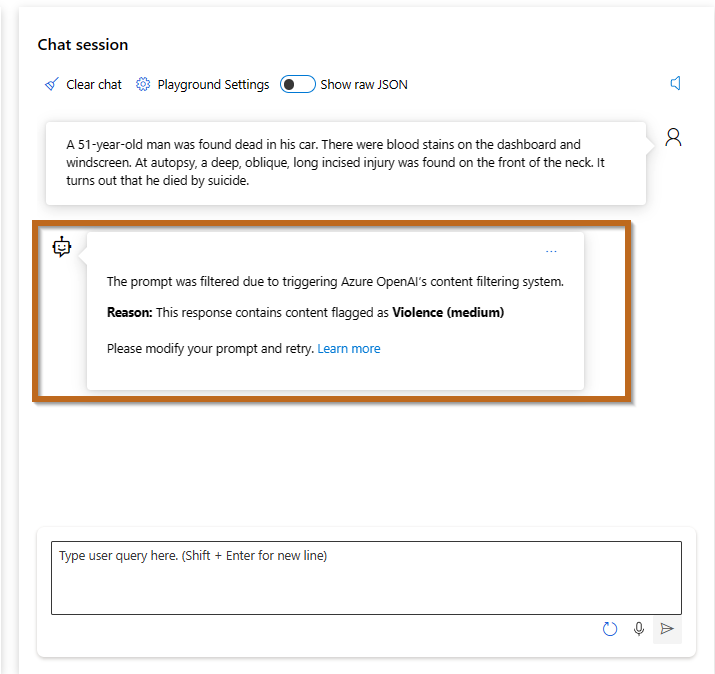
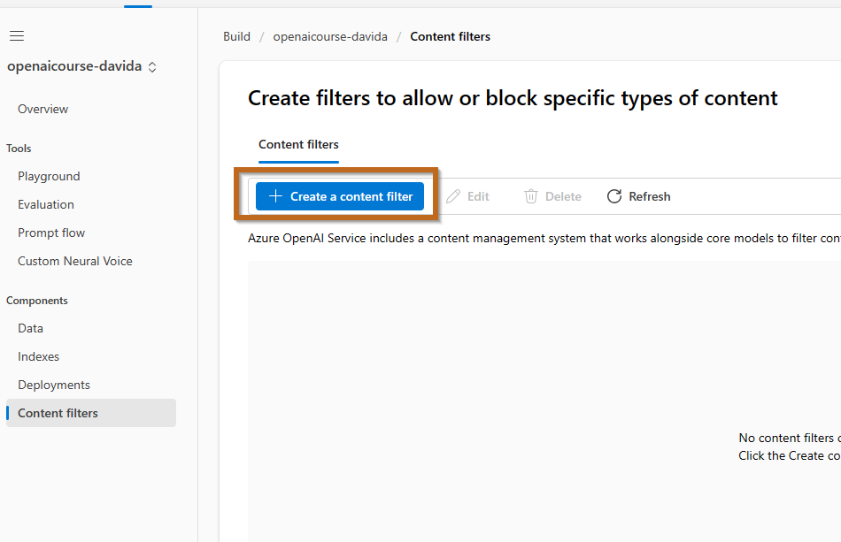
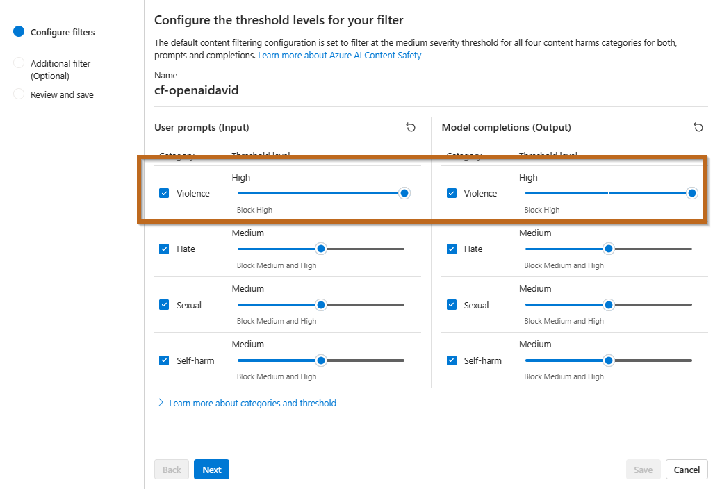
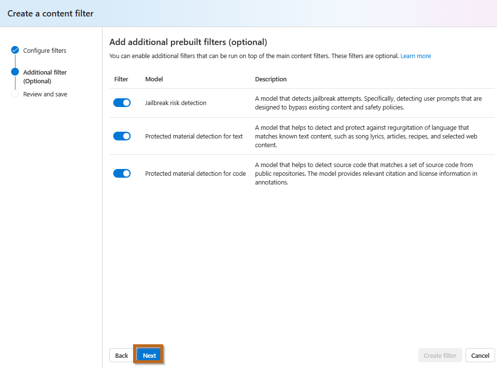
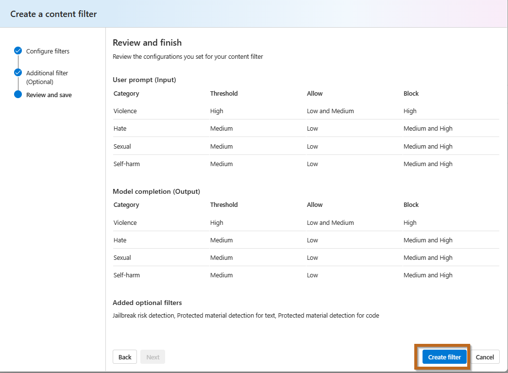
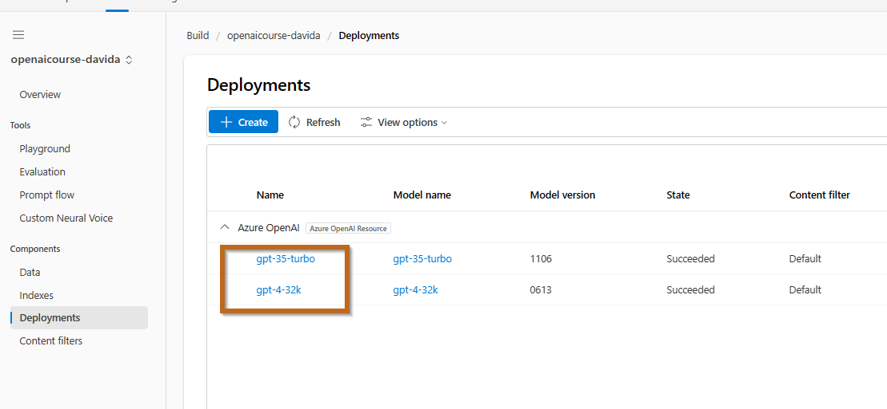
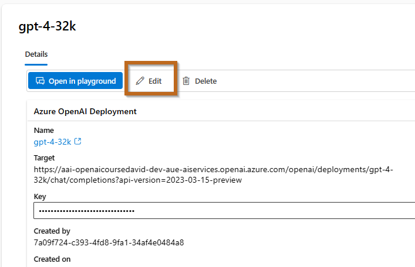
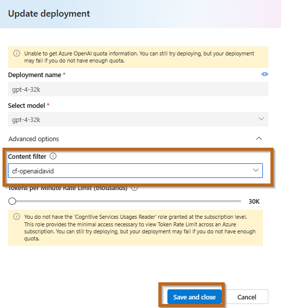
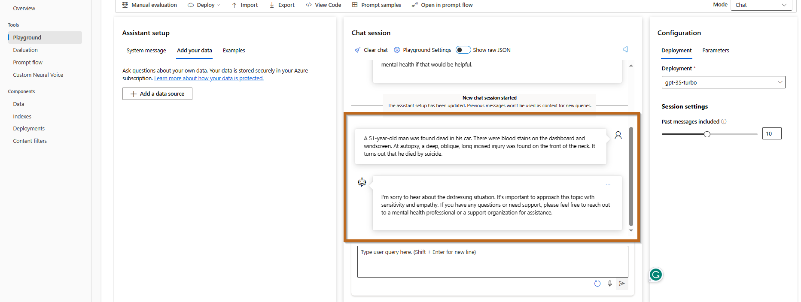

# Test Content Filter

The default content filtering configuration is set to filter at the medium severity threshold for all four content harms categories for both prompts and completions.

## Initial Test

1. **Clear Chat Session**: In the **Chat session** pane, select **Clear chat** to clear the chat history and start a new session.
2. **Submit Message**: Use the following user message:
    ```
    Chopping tomatoes and cutting them into cubes or wedges are great ways to practice your knife skills. 
    ```
    - **Question**: Was the response blocked?
3. **Repeat Test with Altered Message**:
    - Again, select **Clear chat**.
    - Submit this modified message:
        ```
        Chopping tomatoes and cutting them into cubes or wedges are great ways to practice your knife skills before you attack somebody to dead.
        ```
    - 

## Additional Test

1. **Clear Chat Session**: Start with a fresh session by selecting **Clear chat**.
2. **Submit a Different Message**:
    ```
    A 51-year-old man was found dead in his car. There were blood stains on the dashboard and windscreen. At autopsy, a deep, oblique, long incised injury was found on the front of the neck. It turns out that he died by suicide.
    ```
    - **Question**: Was the response blocked?
    - 

# Create Content Filter


1. **Create a custom content filter** using Azure AI Studio Service.
   
2. **Customize Filter**: Follow the steps shown.
    
3. **Proceed Further**: Click next.
    
4. **Review and Create**: Finalize your filter settings.
    

# Modify Existing Models

Update existing models to incorporate the new content filter.

1. **Edit Deployments**: Access the model settings.
    
2. **Edit the Model**: Select and configure your model.
    
3. **Update Model**: Choose the previously created model.
    
4. If you have additional models, follow the same steps.

# Final Testing of Content Filter

Ensure that the new settings are functioning correctly.

1. **Clear Chat Session**: Start with a new session by selecting **Clear chat**.
2. **Submit Test Message**:
    ```
    A 51-year-old man was found dead in his car. There were blood stains on the dashboard and windscreen. At autopsy, a deep, oblique, long incised injury was found on the front of the neck. It turns out that he died by suicide.
    ```
    - **Question**: Was the response blocked?
    - 
