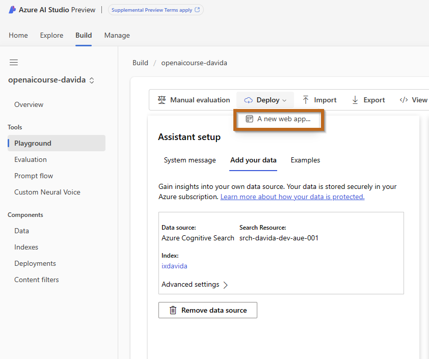
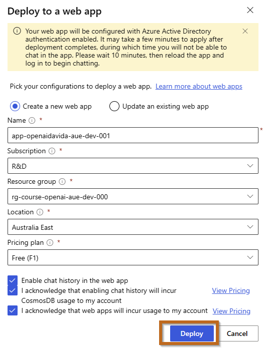
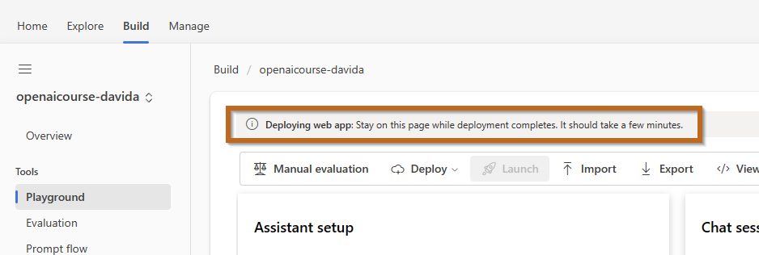
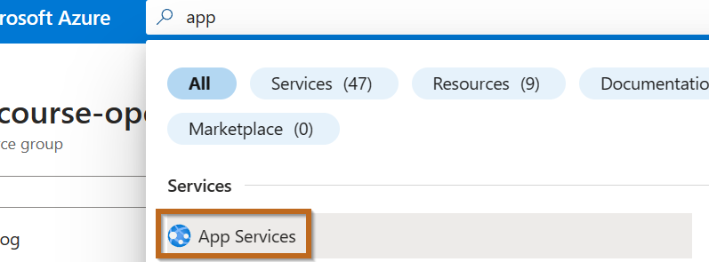
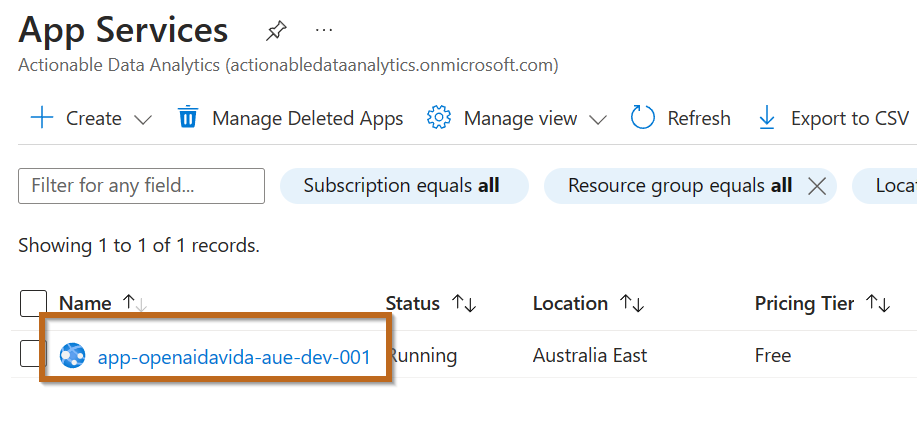
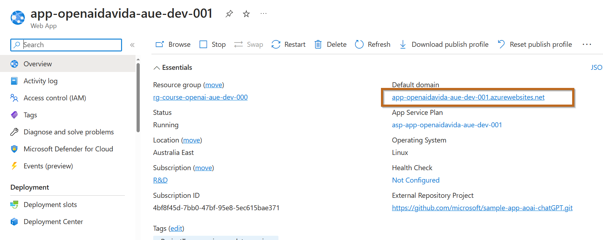
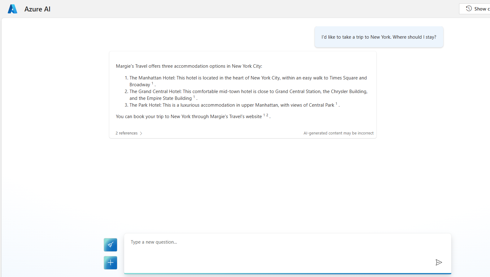

---
lab:
    title: 'Deploy Your Model with Azure AI Studio'
---

# Deploy Your Model with Azure AI Studio

In this lab, you'll learn the step-by-step process to deploy a machine learning model using Azure AI Studio. This platform simplifies and streamlines the deployment process, making it accessible even for those new to cloud-based model deployment.

## Objectives

- Understand the deployment process in Azure AI Studio.
- Successfully deploy a machine learning model to Azure.
- Verify the deployment and understand the basic monitoring process.

## Prerequisites

Before beginning this lab, make sure you have:

- An active Azure account.
- A machine learning model ready for deployment.
- Basic familiarity with Azure AI Studio.

## Step 1: Initiate Model Deployment

1. **Navigate to Azure AI Studio**:
   - Log in to Azure AI Studio through your Azure account.

2. **Select Your Model**:
   - Choose the machine learning model you want to deploy from your list of available models.

3. **Begin Deployment Process**:
   - Click the **Deploy** button to initiate the deployment.
     

## Step 2: Configure Deployment Settings

1. **Deployment Configuration**:
   - On the deployment screen, configure the necessary settings for your model.
    

  > **Note**: Another way to create the Azure Web App is from the Azure Portal. This is the recommended approach for enterprise deployment as it offers more options in regards to networking and security.

## Step 3: Monitor Deployment Process

1. **Deployment Status**:
   - After configuring the settings, submit the deployment.

    

2. **Check Deployment Completion**:
   - The deployment might take several minutes. Once completed, you'll receive a notification, or the status will indicate that the deployment is done.

## Step 4: Checkpoint and Validation

1. **Notify Instructor or Supervisor**:
   - Once the web app is being deployed, inform your instructor or supervisor.
     - **Checkpoint:** Confirm the deployment initiation.

2. **Validate Deployment**:
   - After deployment, validate the deployment by visiting the website.
   - Navigate to Azure Portal [https://portal.azure.com/](https://portal.azure.com/).

    

    Select your web app.

    

    Click on the link.

    

    Test the chat, noticed that the chat history might not work.

    

## Conclusion

Successfully deploying a model in Azure AI Studio is a significant milestone. This process involves selecting the right settings and ensuring the model's performance in a production environment. Reflect on any challenges encountered during deployment and consider how the process might be optimized in the future.

